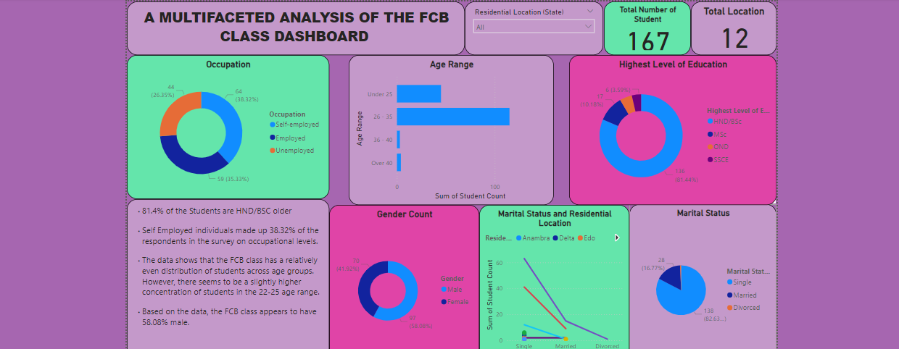

# FCB DTA Class Student Analysis

This report details the analysis of student data from a recent data analyst bootcamp. The objective is to understand the program's demographics and identify any trends or patterns related to student background and participation.

## Project outline

- Data Sources

- Tools Utilized

- Data Analysis

- Data Visualization

- Key Takeaways

- Conclusion

## Data Sources

Google Form

## Tools utilized

- Ms Excel [Download Here](www.microsoft.com)
- MS Power BI
- Google Form

## Data Analysis

Diving into the bootcamp participant data, I started with demographics. I was curious about the gender makeup, so I analyzed the percentage of male and female participants. Age was another key factor. To understand the typical participant age range, I visualized the age distribution with charts. Next, I looked at educational backgrounds. I identified the most common level of education attained by the participants, such as Bachelor's degrees, Master's degrees, or something else entirely. Geographical diversity was also interesting. By exploring the location data, I could see where students were coming from across the country. But it wasn't just about demographics. I wanted to see if there were any deeper connections. For example, was there a correlation between a participant's highest level of education and their prior occupation? Maybe people with higher degrees came from specific fields. So, I investigated any potential links there. Finally, I considered marital status. It was worth exploring if there were any trends between being married or single and participation in the bootcamp. This could be a valuable insight for the program in terms of outreach strategies.

## Data Visualization

 

 

|Heading 1 | Heading 2 | Heading 3 |
|----------| ----------| ----------|
|Data 1| Data 2|Data 3|

|Age | Sex | School |
|----| ----| -------|
|12|F|FCB|
